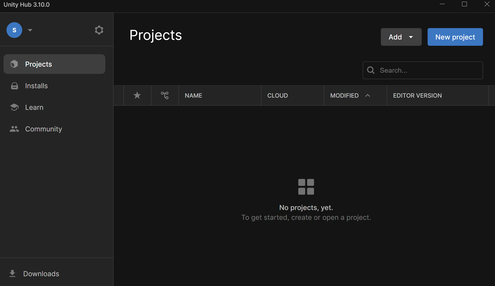
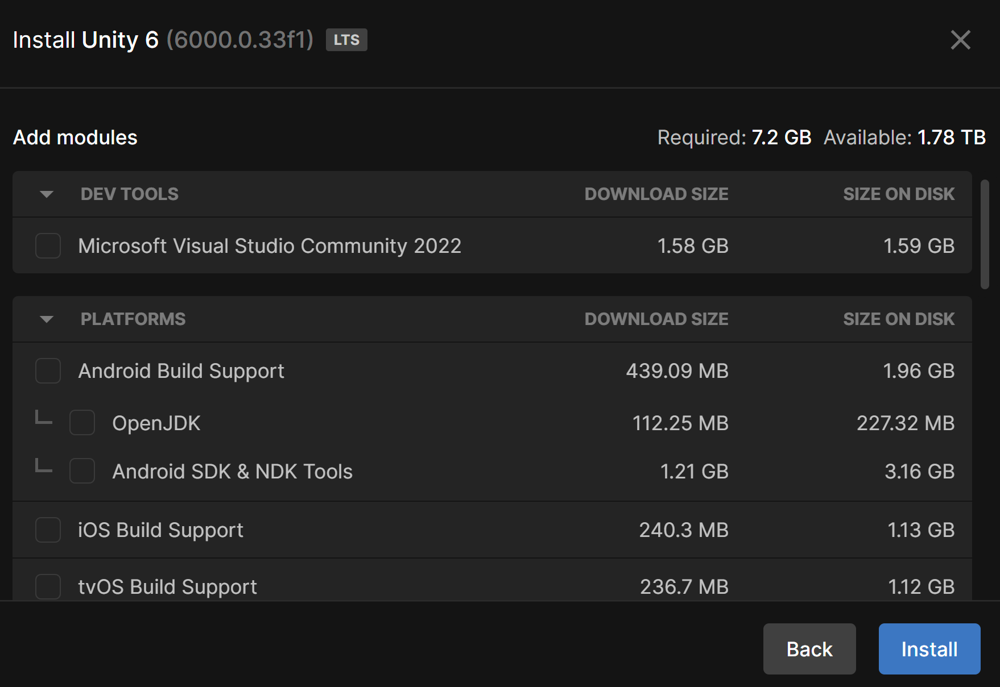

## Download Unity Hub
***

> [!IMPORTANT]
> On macOS, you’ll need to select whether you’re using a Silicon or Intel processor. If you’re not sure what type of Mac processor you have, [read this support article from Apple](https://support.apple.com/en-us/116943).

1. Go to https://unity.com/download

2. On this page you'll see links under their first step. 
   - You want to download the correct one depending on your operating system.

This will download the Unity Hub, which is an application where you can download various version of the engine and where you will create and launch your projects.

3. After Unity Hub finishes downloading, install the program. 
   - You can leave any options set to their default values.

## Open Unity Hub and Create an Account
***

* After the install is complete, lauch Unity Hub. 
    - You'll be greeted with a prompt to sign in. If you happen to have a Unity account that you want to use, feel free to sign in. 
    - Otherwise, click on the option to Create Account.

## Creating an Account
***

After clicking "Create Account", your web browser should open.

1. Fill out the form. 
    - You don't have to use your LSU email, but if you do, you can apply for the education version of Unity that gets you some discounts. 

> [!TIP]
> Also, I recommend only checking the first two options at the bottom. 
> If you agree to the third, you'll get spam.

2. Once complete, click on "Create Unity ID"

3. Once you have an ID, you can head back to the Hub and click on "sign in".
   - This will again open your browser and you may see a redirect link pop up like this:
   
   - Click on "Open Link"

This should take you back to the Hub, where the interface should load to look like this:

## Requesting a Student License (Optional)
***
If you created your Unity account using your school email and would like to change your license from personal to student, go here: https://unity.com/products/unity-student

Then click on the "Get Started" button under Post-secondary students. If you're signed in, this will open a page where you can follow the steps to have your account changed to student.

## Installing Unity Engine
***

1. Click on "Installs" on the left-hand side of the Hub. 
2. Then click on the blue "Install Editor" button in the top-right.

You'll see a list of versions to install. For this course, we're going to be using the latest LTS version of the engine, which is 6000.0.33f1 as of this writing.

> [!IMPORTANT]
> On macOS, you’ll need to select whether you’re using a Silicon or Intel processor. If you’re not sure what type of Mac processor you have, [read this support article from Apple](https://support.apple.com/en-us/116943).

### Select Modules

Next you have a list of modules that you can choose to install. You don't need all of them. We just want to make sure that we can publish games for Mac and Windows.

From the list:
* Uncheck - Microsoft Visual Community 2022
    - If you are familiar with this IDE and like it, feel free to keep it. 
    - We will be installing VSCode, which I find the UI to be cleaner, as our IDE later on.

* Check - Mac Build Support (Mono)
* Check - Universal Windows Platform Build Support

Then click on the "Install" button.

You should now see the progress of your install.

As Unity is installing, you can go ahead and start installing VSCode.
