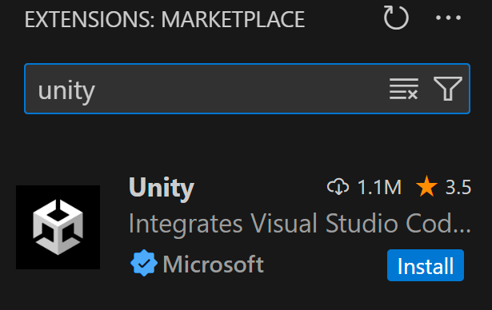

# Installing Visual Studio Code

> [!IMPORTANT]
> On macOS, you’ll need to select whether you’re using a Silicon or Intel processor. If you’re not sure what type of Mac processor you have, [read this support article from Apple](https://support.apple.com/en-us/116943).

## Download
***
Head here: https://code.visualstudio.com/Download

Download the appropriate version for your operating system and processor.
For Mac, I recommend downloading the .zip file, and for Windows, download the User Installer.

## Install
***

* Launch the installer to install VSCode on your machine. You can keep all of the default options selected for install.

When you launch VSCode, it should look something like this:

# Install the Unity for Visual Studio Code Extension
***
So to make some of the magic happen we need to install an extension. 

* You can open the extension marketplace by clicking on this button in the left-hand panel:

* If you search for "unity" you should see the extension needed at the top

* Click on the small blue install button.

After the extension completes install and the Unity engine has finished installing, head to the next section.

---
>Prev: [Installing Unity](/01_Setup/SETUP.md)  |  Next: [Unity's Interface and Navigation ](/03_EditorOverview/EDITOR.md)
