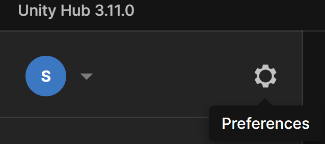
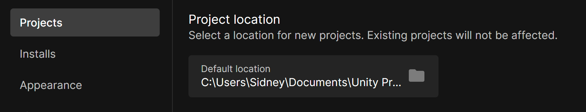
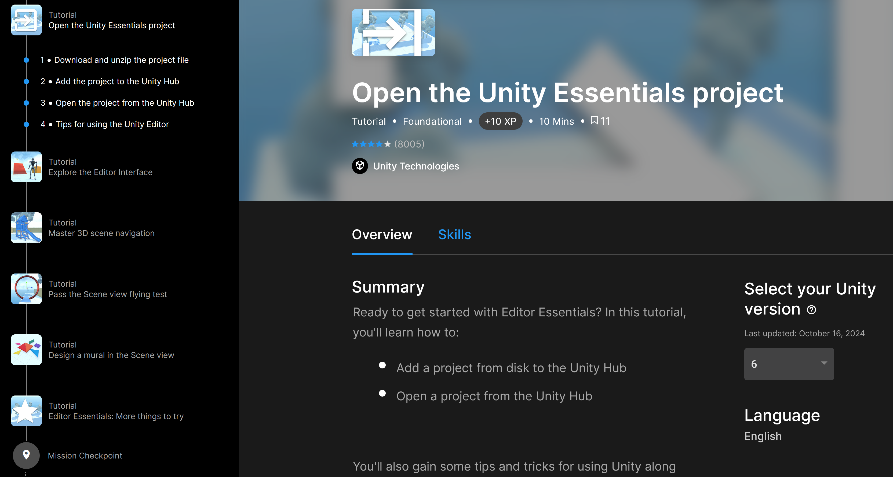

# Unity's Interface and Navigation
***
In a moment, I'm going to be lazy and pass you off to one of Unity's written tutorials. Before that, you need to know where your Unity projects are going to be saved on your computer.
Honestly, they can be saved anywhere, but it's better to have a central location for all of your projects. 

To find out where your projects are being saved:
* Open Unity Hub
* On the left-hand side, you should see your name initial in a circle and a gear icon to the right of that. 
  * Click on the gear icon.

When the Preferences window opens, you should see the default location on your computer where Unity is saving your projects.

> [!TIP]
> Feel free to change the location if you want. I created a folder inside my Documents folder to be my default location.
> If you'd like to change it, just click on the folder icon and navigate to the folder where you'd like your projects to be saved.

## The Handoff
***

Unity has already put together a well written guide for learning and navigating their interface, so I'm going to have you follow that.
I want you to start at "Open the Unity Essentials projects" and stop after "Editor Essentials: More things to try". This will put you in a good position for the next section where we'll dive into actually doing things inside of the engine.

[You can find Unity's tutorial here. ](https://learn.unity.com/tutorial/open-the-unity-essentials-project?uv=6&pathwayId=664b6225edbc2a01973f4f19&missionId=664bdda6edbc2a09177bccae#)

---
>Prev: [Installing Visual Studio Code](/02_IDE/IDE.md)

